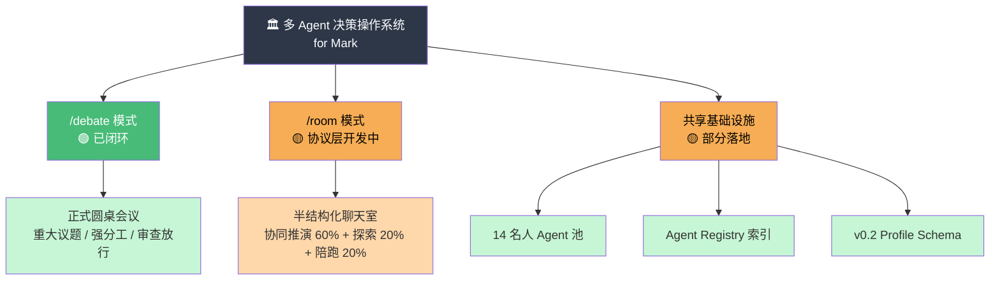
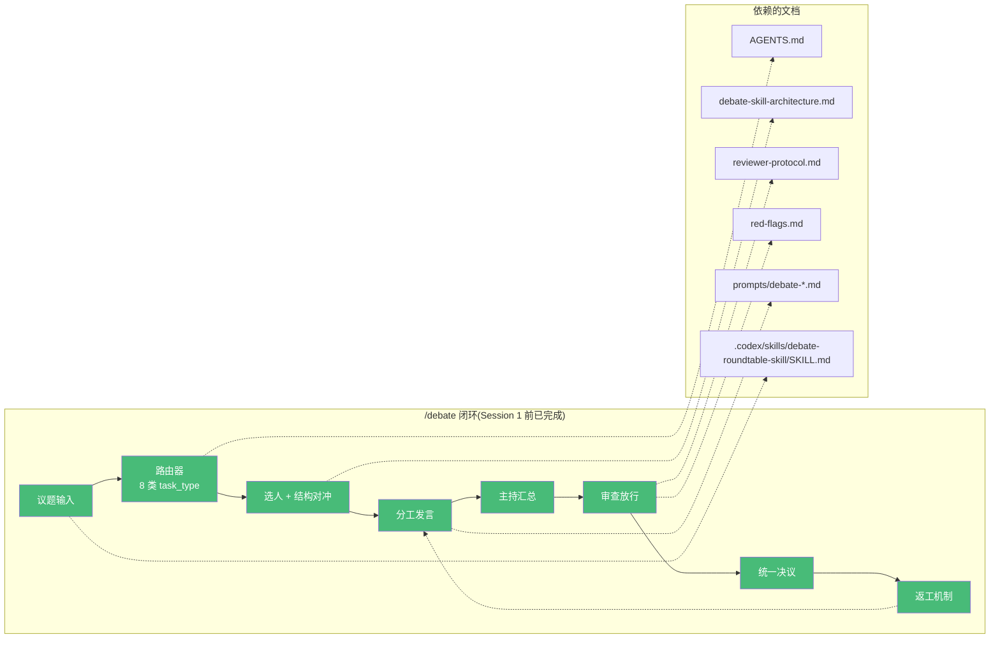
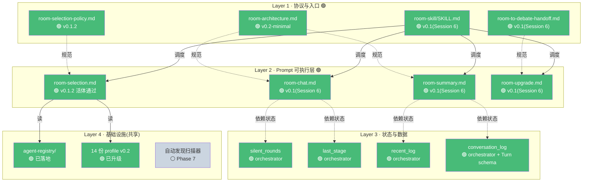
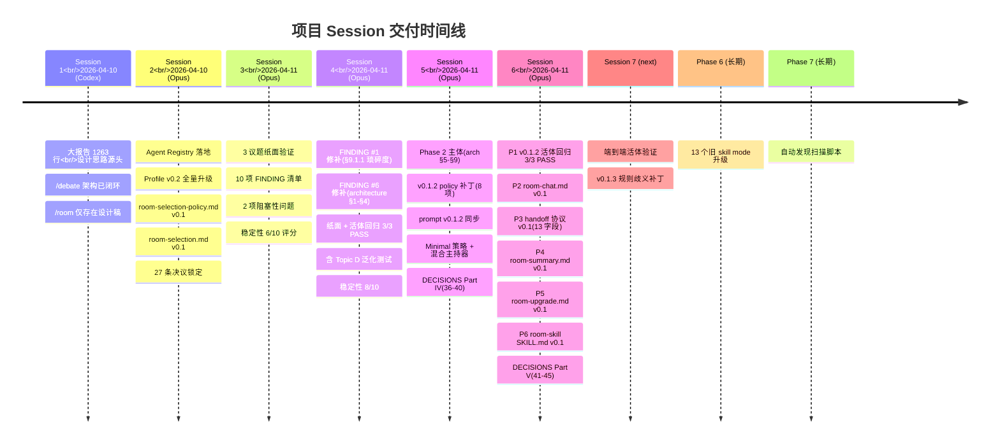
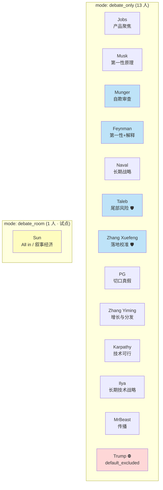
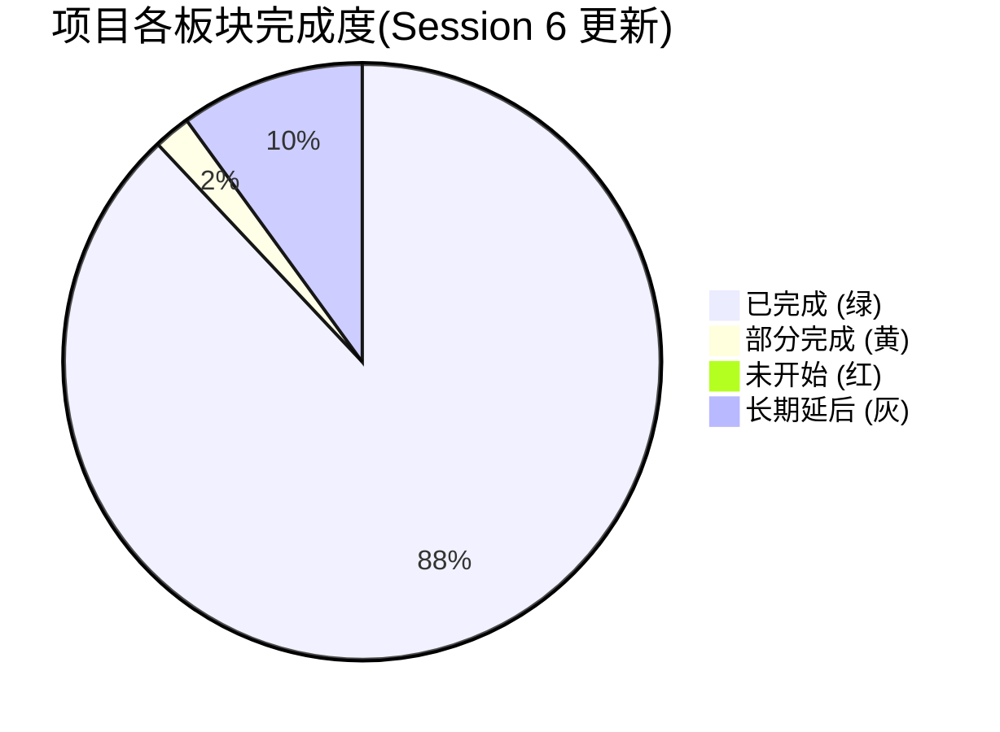
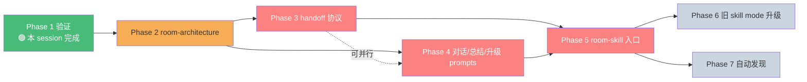

# 圆桌会议项目结构图

生成:2026-04-11(Session 3)| 最后更新:2026-04-11(Session 6)
用途:让项目全貌一眼看清——双模式架构、各板块完成度、依赖关系。

**Session 6 同步**:Phase 3/4/5 全部落地 —— Layer 1 的 room-to-debate-handoff.md / Layer 2 的 room-chat/summary/upgrade.md / Layer 4 的 room-skill 从 🔴 升级到 🟢;时间线追加 Session 6;完成度从 Session 5 的 ~70% → Session 6 的 ~90%;剩余 10% 是 Phase 6/7 长期项。

---

## 图例

| 状态 | 含义 |
|---|---|
| 🟢 | 已完成,闭环可用 |
| 🟡 | 已落地但有缺口,可用但有风险 |
| 🔴 | 未开始或严重缺失 |
| ⚪ | 长期延后(Phase 6+) |

---

## 1. 项目总览:双模式操作系统



---

## 2. `/debate` 模式结构(🟢 完整闭环,零改动)



**硬约束**:`/debate` 在 Session 2/3 中**零破坏**——所有旧文件、旧路径、旧行为全部不动。这是不可推翻的边界(决议 2)。

---

## 3. `/room` 模式结构(🟡 分层开发中)



---

## 4. 文件物理布局(C:\Users\CLH\)

```
C:\Users\CLH\
│
├── 📘 AGENTS.md                              🟢 [/debate 使命]
│
├── 📂 docs/
│   ├── debate-skill-architecture.md          🟢 [/debate 架构]
│   ├── agent-role-map.md                     🟢 [/debate 角色映射]
│   ├── reviewer-protocol.md                  🟢 [/debate 审查协议]
│   ├── red-flags.md                          🟢 [/debate 红旗清单]
│   ├── room-selection-policy.md              🟢 [v0.1.2 · S2/S4/S5 累积]
│   ├── room-architecture.md                  🟢 [v0.2-minimal · S4 §1-4 + S5 §5-9]
│   └── room-to-debate-handoff.md             🟢 [v0.1 · S6 新增]
│
├── 📂 prompts/
│   ├── debate-*.md (多份)                    🟢 [/debate prompt 套件]
│   ├── room-selection.md                     🟢 [v0.1.2 · 活体 S4+S6 通过]
│   ├── room-chat.md                          🟢 [v0.1 · S6 新增]
│   ├── room-summary.md                       🟢 [v0.1 · S6 新增]
│   └── room-upgrade.md                       🟢 [v0.1 · S6 新增]
│
├── 📂 agent-registry/                        🟢 [S2 交付]
│   ├── registry.json                         14 人索引
│   └── README.md
│
├── 📂 .codex/skills/
│   ├── debate-roundtable-skill/
│   │   └── SKILL.md                          🟢 [/debate 调度入口]
│   ├── room-skill/                           🟢 [Phase 5 · S6 新建]
│   │   └── SKILL.md                          🟢 [v0.1 · 398 行]
│   └── <14 名人 skill>/
│       └── roundtable-profile.md             🟢 全部 v0.2 升级
│
└── 📂 .claude/skills/
    └── justin-sun-perspective/               (孙宇晨副本,无 profile)
```

---

## 5. Session 交付物时间线



---

## 6. 14 人 Agent 池全景



**结构分类**:
- 🛡 **defensive** 对冲位(tendency=defensive):Munger / Taleb / Zhang Xuefeng / Feynman
- 🗡 **offensive**(其余 9 人)
- ⛔ **默认排除**:Trump(需 --with 才能进)
- 🌟 **双模式试点**:Sun(首个 mode=debate_room)

---

## 7. 当前完成度总览



### 具体分项完成度(Session 6 更新)

| 板块 | 状态 | 完成度 | 变化 |
|---|---|---|---|
| `/debate` 使命/架构/协议 | 🟢 | 100% | — |
| `/debate` prompt 套件 | 🟢 | 100% | — |
| `/debate` 调度 skill | 🟢 | 100% | — |
| Agent Registry 索引 | 🟢 | 100% | — |
| 14 份 profile v0.2 升级 | 🟢 | 100% | — |
| 孙宇晨 skill 接入 | 🟢 | 100% | — |
| `/room` 筛选协议 | 🟢 | **100%** | **S6:v0.1.2 活体回归 3/3 PASS** |
| `/room` 筛选 prompt | 🟢 | **100%** | **S6:v0.1.2 活体回归 3/3 PASS** |
| `/room` 筛选 prompt 验证 | 🟢 | **100%** | 纸面 + v0.1.1 活体(S3/S4)+ v0.1.2 活体(S6) |
| `/room` 架构协议 | 🟢 | **90%** | S4/S5:v0.2-minimal(§1-§9 完整,3 命令占位) |
| **`/room` 升级 handoff 协议** | 🟢 | **100%** | **S6:v0.1(13 字段 + 5 防污染规则)** |
| **`/room` room-chat.md** | 🟢 | **100%** | **S6:v0.1(4 角色语义 + Turn schema)** |
| **`/room` room-summary.md** | 🟢 | **100%** | **S6:v0.1(4 字段提取 + 合并策略)** |
| **`/room` room-upgrade.md** | 🟢 | **100%** | **S6:v0.1(13 字段打包 + 5 校验)** |
| **`/room` 调度 skill** | 🟢 | **100%** | **S6:v0.1(6 Flow + 规则引擎)** |
| `/room` 端到端活体验证 | 🟡 | 0% | Session 7 推荐动作 |
| v0.1.3 规则歧义补丁 | 🟡 | 0% | 10 项,Session 7+ |
| 13 旧 skill mode 升级 | ⚪ | 0% | Phase 6,长期 |
| 自动发现扫描器 | ⚪ | 0% | Phase 7,长期 |
| 聊天室 UI 原型 | ⛔ | 0% | 当前阶段禁止 |
| 状态持久化 | ⛔ | 0% | 当前阶段禁止(Session 2 决议 27)|

**整体进度**:S3 结束 55% → S4 结束 61% → S5 结束 ~70% → **S6 结束 ~90%**(剩余 10% 全是长期延后项)

---

## 8. 关键依赖关系(谁必须先做完)



### 阻塞关系说明

- **P1 → P2 是硬串行**:Phase 1 暴露的 FINDING #6(silent_rounds 无所有者)必须先在 P2 的状态模型中解决,否则 P4 的 `room-chat.md` 就是空中楼阁
- **P3 和 P4 可以并行**,都只依赖 P2
- **P5 同时依赖 P3 和 P4**,是收口环节
- **P6/P7 是长期延后**,完全不阻塞主路径

---

## 9. 锁定的边界(不可推翻)

| 编号 | 锁定内容 | 为什么不能改 |
|---|---|---|
| 1 | `/debate` 不改聊天室 | 重大议题需要强分工,失去分工就失去产品价值 |
| 2 | `/room` 权重 60/20/20 | 产品定位依据,改了等于换产品 |
| 3 | Agent 只用本地名人 skill | 不造新人格系统,节省复杂度 |
| 4 | 新 skill 自动发现 + 条件注册 | 装上即参会会淹没核心 Agent |
| 5 | 选人用半结构化评分 | 不让模型自由拍脑袋,可复现 |
| 6 | `/room → /debate` 走 handoff packet | `/debate` 不直吃聊天日志防污染 |
| 7 | 当前只做协议 / 文档 / prompt | 不碰聊天室 UI / 持久化 / 工程实现 |
| 8 | sub_problem_tags 锁 20 个 | 词表膨胀后评分一致性会崩 |
| 9 | 物理文件零搬动 | 搬动会立即破坏 `/debate` |
| 10 | 孙宇晨 profile 只在 .codex/ 一侧 | 避免双权威冲突 |

---

## 10. 下一步(Session 6 完结 → Session 7 路径)

### ✅ 已完成(Session 6 全部 P1-P6)

1. ~~P1:v0.1.2 活体回归 3/3 PASS~~ → Session 6 ✓(VALIDATION §13)
2. ~~P2:prompts/room-chat.md v0.1~~ → Session 6 ✓
3. ~~P3:docs/room-to-debate-handoff.md v0.1~~ → Session 6 ✓
4. ~~P4:prompts/room-summary.md v0.1~~ → Session 6 ✓
5. ~~P5:prompts/room-upgrade.md v0.1~~ → Session 6 ✓
6. ~~P6:.codex/skills/room-skill/SKILL.md v0.1~~ → Session 6 ✓
7. ~~DECISIONS-LOCKED Part V(41-45)~~ → Session 6 ✓

### 🏆 Session 7 最推荐动作:端到端活体验证

**执行方式**:用 room-skill 跑一个完整 room:
```
/room <议题> → 第 1 轮发言 → 第 2-3 轮发言 → /summary → /upgrade-to-debate → /debate 决议
```

**暴露的潜在问题**:
- Turn schema 在 prompt 与 architecture 之间的字段名一致性
- previous_summary 在 orchestrator → summary prompt 的传递链路
- packet 13 字段在实际 room state 下的填充完整性
- silent_rounds / recent_log 更新时机与 §3.1 描述是否吻合

### 🟡 Session 7 可选动作:v0.1.3 规则歧义补丁

10 项规则歧义(详见 `VALIDATION-REPORT §13.6`),按严重度 4 中等 + 6 低。建议在端到端活体跑通后一并处理。

### ⚪ 长期延后

- Phase 6:13 个旧 skill mode 升级到 debate_room
- Phase 7:自动发现扫描脚本
- 聊天室 UI 原型(禁区)
- 状态持久化(禁区)
- 语义级 stage 漂移检测(§9.4 明确不做)
- 3 档换人机制(Session 5 决议 38 明确砍掉)

---

_本结构图由 Session 3 于 2026-04-11 生成 / Session 5 于 2026-04-11 同步 / Session 6 于 2026-04-11 全面同步(Phase 3/4/5 完成,~90% 进度)。用于接手者快速建立项目全局认知。_
